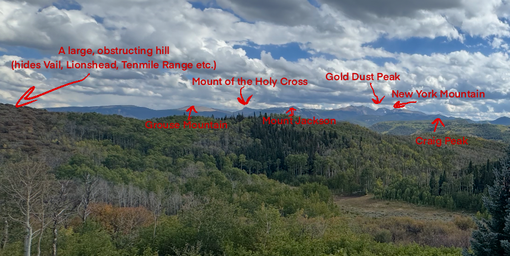
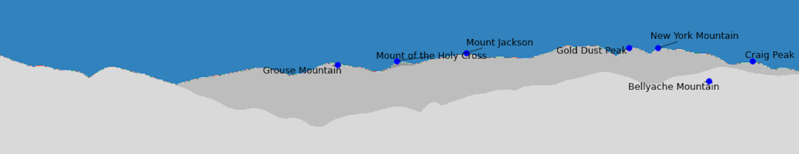
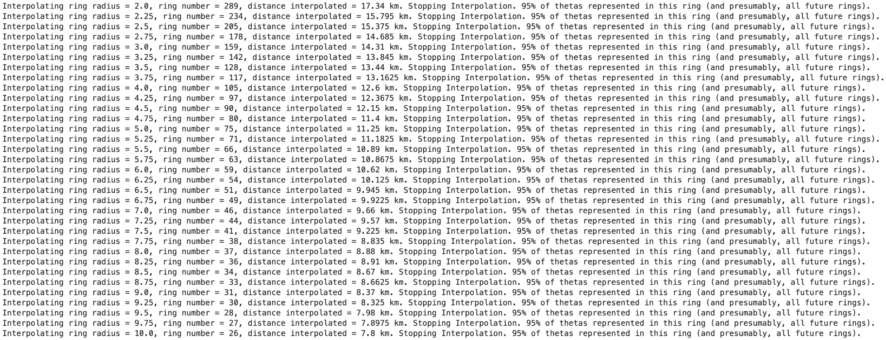
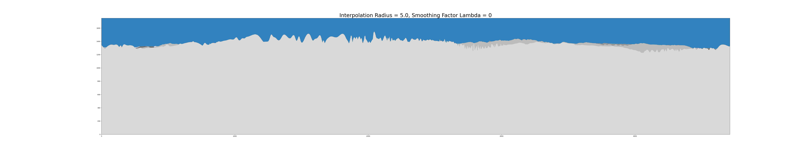
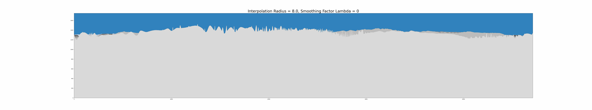
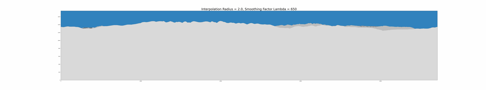

I recently rewrote the panoramic rendering function, and wanted to discuss some of the motivations, and some of the architectural / hyperparametric choices made in this reworking of the function.

This document will discuss

1) Why interpolation for the panoramic rendering function is needed.

2) How interpolation was approached.

3) Hyperparameter testing / how lambda and rad values change the rendered image.

To demonstrate the need for interpolation, below are three photos and a gif. The first shows the view from a trail I hiked this summer. There are a few beautiful mountains, and to the left, a large hill that completely blocks out Vail, Lionshead, Peaks 1-10 and I’m sure a few others.

Next, here’s a (cropped) panoramic render showing the view from that photo location without near radius interpolation:

Here’s a (cropped) panoramic render with interpolation:

And finally, here’s a gif showing how interpolation greatly reduces the number of false positive labelled mountains:

Across tests, these spikes seen in the first rendering are from DEM pixels close to the site of the photograph. These spikes are due to the relatively low sampling resolution of the DEM - each DEM pixel has a 30m x 30m resolution (which is the best resolution offered over the entire continental US). But the render’s x axis, theta, has ~4000 sampled points. That means a hill / mountain, if sufficiently small in footprint, will ‘fill in’ only some thetas (e.g. a hill that is 10 pixels may have points at theta = 1.221, 1.222, 1.223, 1.224, and 1.225, but no points at theta = 1.2215, 1.2225, 1.2235 etc.). However, reducing the number of theta’s sampled would only serve to lower the resolution of the rendering, making the registration step far harder if not impossible. Fortunately, as distance grows, this issue becomes far less pressing (hills that would cause this error, when viewed from a mile away, are simply part of the ridgeline – maybe there’s a small blip, but it’s hardly noticeable if at all.)

So it’s a tradeoff. Sampling more thetas produces a better distant ridgeline, but causes these spikes close to the origin, while sampling less thetas would mean there would be less spikes (there would still be some spikes), but a lower resolution distant ridgeline. Interpolation is the current solution.

A note* The above renders are stretched vertically ever so slightly, but will be corrected for in the image registration step in the pipeline.

2) To interpolate, I first had to select the points for interpolation. To do this, I took all points within a certain radius R of the origin. I interpolated those elevation values across all thetas in the rendering. The next interpolatory ring was defined by all elevations a distance R to 2R away from the origin. The ring after was all elevations a distance 2R to 3R from the origin, and so on, until a ring has 95% of the thetas present. Then the interpolation stops. I tested up to R = 10 pixel widths.

Once points were selected, I used scipy’s make_smoothing_spline for the interpolation. I also tried CubicSpline and UnivariateSpline, as well as a linear interpolation. CubicSpline uses all available points as knots, while UnivariateSpline had, as a parameter, a smoothing factor that reduced the number of knots (same as make_smoothing_spline). All the same, I got smoother results with make_smoothing_spline (at k=3). Comparisons of smoothing factors and radians are found below.

There are a few hyperparameters at play – 95% coverage, lambda, and radius of rings the big ones. Future work can and should be done to validate hyperparameters chosen for this step. Namely: quantifying variability of perceived heights of each ring, quantifying information lost due to interpolation at a given radius, selecting radii based on completeness of theta sampling or the equisampling of theta (if a radius gives us every 8th theta, for instance), selecting lambda based on GCV solution estimation (approximate GCV solution for a given number of points and variance), and more. Even the method of interpolation and knot selection for interpolation could be further evaluated.

This is a ‘good enough’ solution. I started this project because I couldn’t name mountain peaks far away. I drive through Colorado a lot, and take photos of mountains while driving. I want to label those mountains. So, for my use case, almost all named peaks will be outside the last interpolation ring. Further, any named mountain peak should correspond to a picture more than large enough in footprint to negate the close proximity spiking. Also, it’s rare to be close enough to a mountain peak to invoke the interpolation. And lastly, given the DEM sampling issue (which lead to the need for interpolation), taking a photo right next to a mountain peak would likely fail, regardless of interpolation, as that peak would be rendered like minecraft if you are too close to it (and the registration wouldn’t like that).

3) To evaluate how the smoothing factor lambda and the radius of the interpolation rings change the rendering, I rendered a few hundred scenes, and made gifs stepping through the parameters. I tested radii of 2 pixels to 10 pixels (meaning 60m to 300m rings), stepping in .25 steps, and lambdas ranging from 0 to 1000, with steps of 50. I also evaluated the interpolation performance at each radii with a lambda derived from the GCV solution. In my opinion, the best option was to interpolate using a small radius and a GCV derived lambda. However, this GCV derivation greatly increased the time complexity of interpolation (~10x) compared to interpolation with a static lambda.

Again, this is a good enough solution. Right now, evaluating the effect of these parameters has been qualitative. I want to come back and formally evaluate best parameter selection with quantitative measures. Right now, I want to focus on U-net segmentation of images and on photographed ridgeline to rendered ridgeline registration. I ended up choosing a ring radius of 3, and a lambda of 1000. It’s a trade off, a higher ring radius means there is less data to be interpolated (look to distance interpolated below), but because there is more information in each ring, you lose more of that information. These parameters become just another thing you can tune.

Anyway, gifs and other things!

How far do you need to interpolate with a given interpolating ring radius before (mostly) full coverage of thetas?

Varying lambda gifs (interpolating radius stays constant):

Varying interpolating radius gifs (lambda stays constant):

