**Introduction**

I started this project for a few reasons.

1. I love the mountains. I am horrible at identifying mountains and wanted to make an algorithm that helps with this.  
2. While I’ve read a good deal about Deep Learning (DL), have learned about DL in previous courses, and understand the theory, I wanted more practice in DL implementation. Towards that end, I wanted a project where I can explore DL techniques (specifically CV techniques).

This project has, so far, been largely successful. I’ve rendered mountain ranges that clearly label visible peaks, and look exactly like the mountains before me. (A quick note: production apps like PeakFinder approach this problem in this way it seems. They massage the data to offer fast, efficient rendering of mountain ranges, then have the user manually register the rendered peaks to the image.) 

With the second aim, I’ve learned a tremendous amount about U-nets, have practiced their implementation (to a relatively granular level), have learned how to create custom blocks, custom loss functions, how to integrate TensorFlow with python functions, as well as with CV2, Numpy, and a number of other foundational ML libraries. I now know how to create custom datasets (using GroundingSAM as an initial segmentation, and further refining masks with GUIs.) I know how to load these image-mask paired datasets for use in a TF pipeline. I have implemented batch normalization and dropout layers, and I understand when and where I would implement these. I know how to evaluate a U-net, both visually and quantitatively. In short, I’ve learned a lot. So if my only goal was to learn about U-nets, the project has been a success. But that was only a secondary goal.

To take a step back, I only wanted to segment the photos as a means to be able to register the photo to the render. The render is a 540 degree panorama of the surrounding ridgeline (540 as opposed to 360, as to account for views that would cross the initial 360 boundary), while the photo is but a small portion of this view. In my experience in medical imaging, registrations would often assume each image fundamentally represents the same thing. That is, image A, despite its distortions (whether that be scaling, shearing, rotations, or any number of non-rigid image deformations), is analogous to image B. All of image B is in image A, and all of image A is in image B. This is not a hard and fast assumption. At times, image A only represented, say, 90% of image B. But never was I registering two images where image A was only 5% of image B, only 10% of image B. 

Image A, the photo, sometimes has clouds, often has roads and cars and houses. If you take the photo out of a car, perhaps it will have the dashboard, or the windowframe. Some mountains will be monotonous in color, but others are green and gray and white. 

Image B, the render, would be the static image (Image A is registered to Image B.) The render does not have clouds; the only difference in mountain color is corollary to the distance of the mountain from the viewpoint. 

To identify points in the render that uniquely exist in the photo as well would be challenging. A better way, I thought, would be to isolate the photo ridgeline and rendered ridgeline, and register the photo ridgeline to the rendered ridgeline.

**The Fundamental Snowy Peak Problem**

But this approach, it seems, was flawed. Unfortunately, mountain ranges are often capped with snowy peaks, and all too often, clouds dip below the peakline. Both of these factors contribute towards the challenge of accurate segmentations. In examples below, even with my best efforts, you will see how these unique challenges cause segmentations to fail. Segmentations, by their nature, work best when there is pixel-level context separating foreground from background. But what happens when the foreground and background are the exact same color and texture? When the delineation is but the continuation of the segmentation outside the clouds? This could be argued to be an edge case, but at the end of the day, this project is about learning. What better way to learn than coming across a problem like this?

This specific challenge isn't unique to U-nets. I tried segmenting images via Canny and Sobel operators. I tried using watershed segmentations, clustering and thresholding methods. I haven’t included any of those results, because they simply didn’t work. Anytime a cloud was present around the ridgeline, these methods failed, and failed horribly so. 

**Examples of problematic images and their associated masks**  

Each of these images have, even to the human eye, unclear ridgelines. The masks, then, are best guesses. In making this dataset, I tried to guess at the true ridgeline. But even this, often, proved fruitless. I did err on the side of what I saw – I didn’t want to poison my dataset. Approximately a quarter to a third of scraped images of mountains had this issue.   
I have come to appreciate why apps will either use your phone’s gps and accelerometers to just place the render in the right place, or will have the user register the images themselves.  
**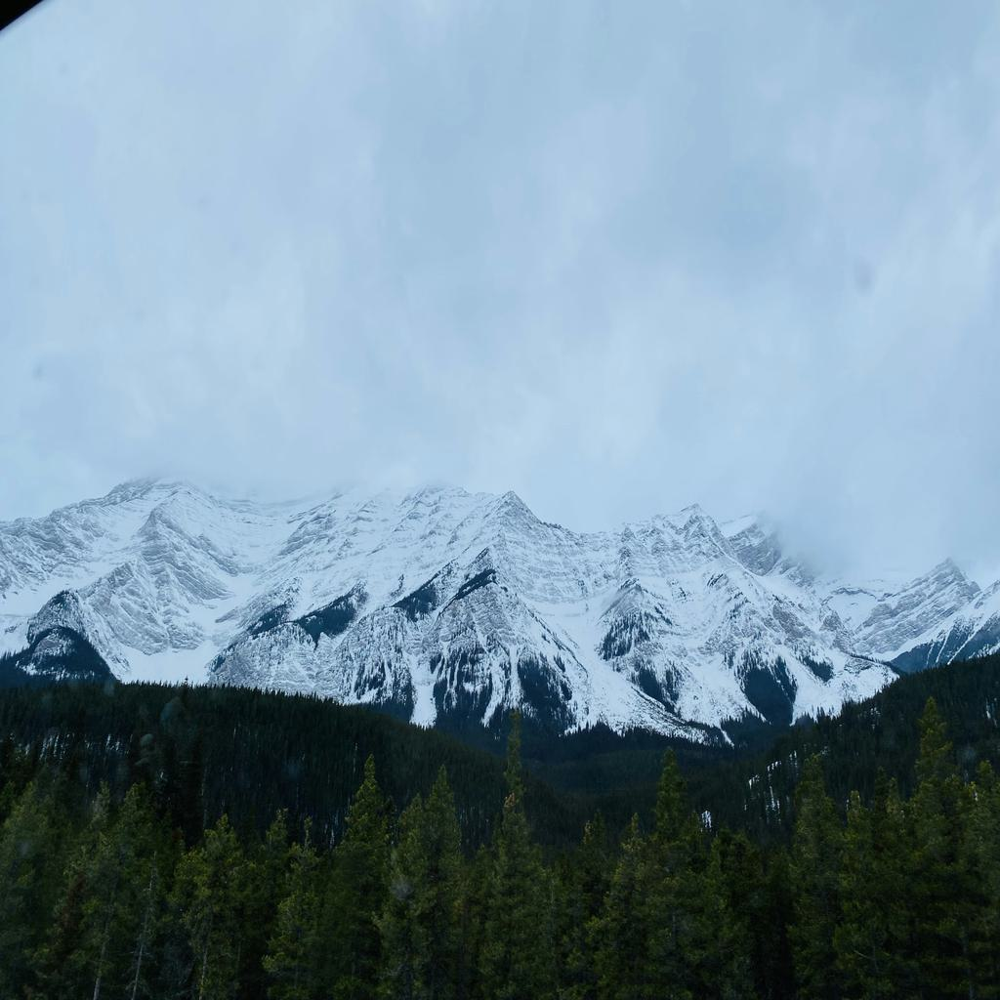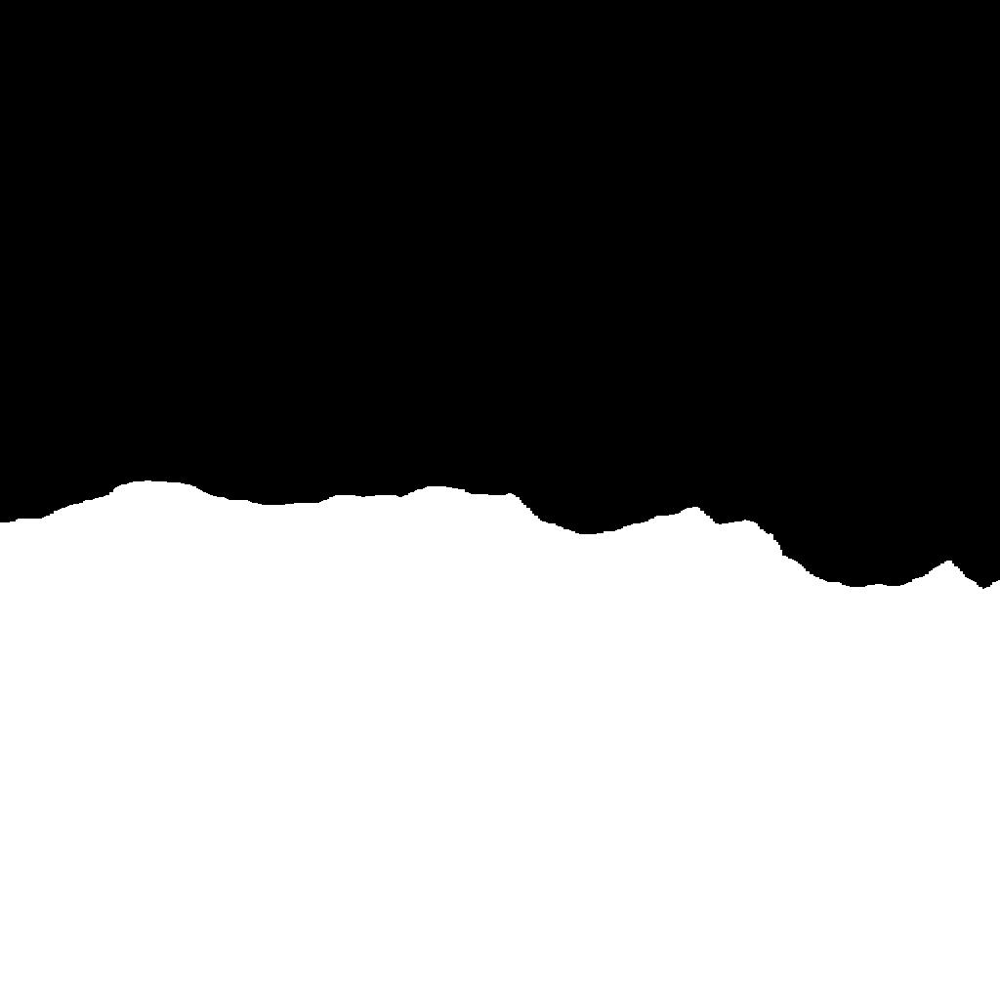**  
**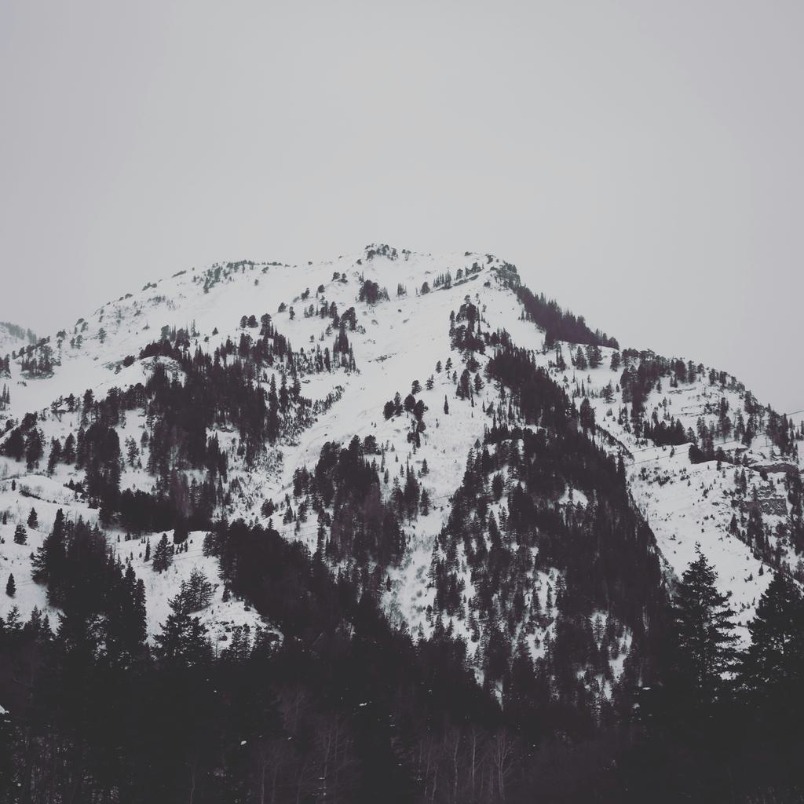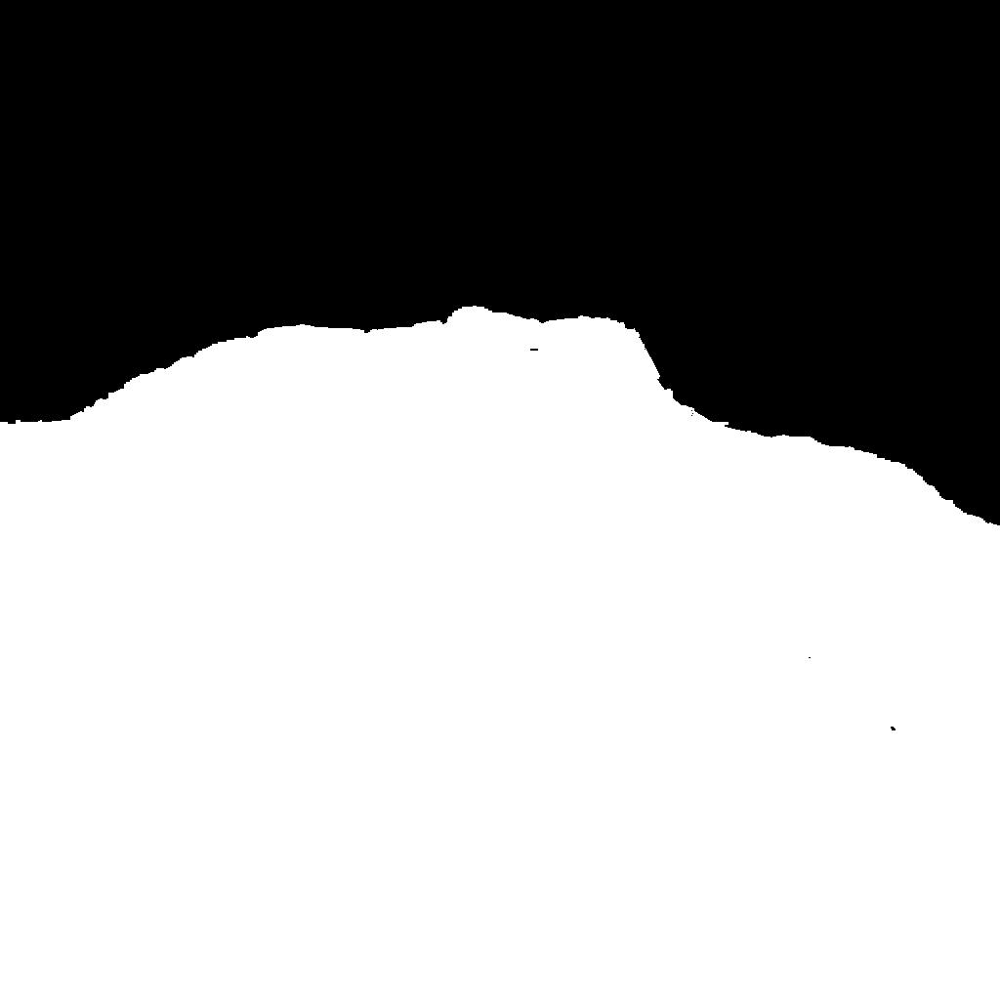**  
**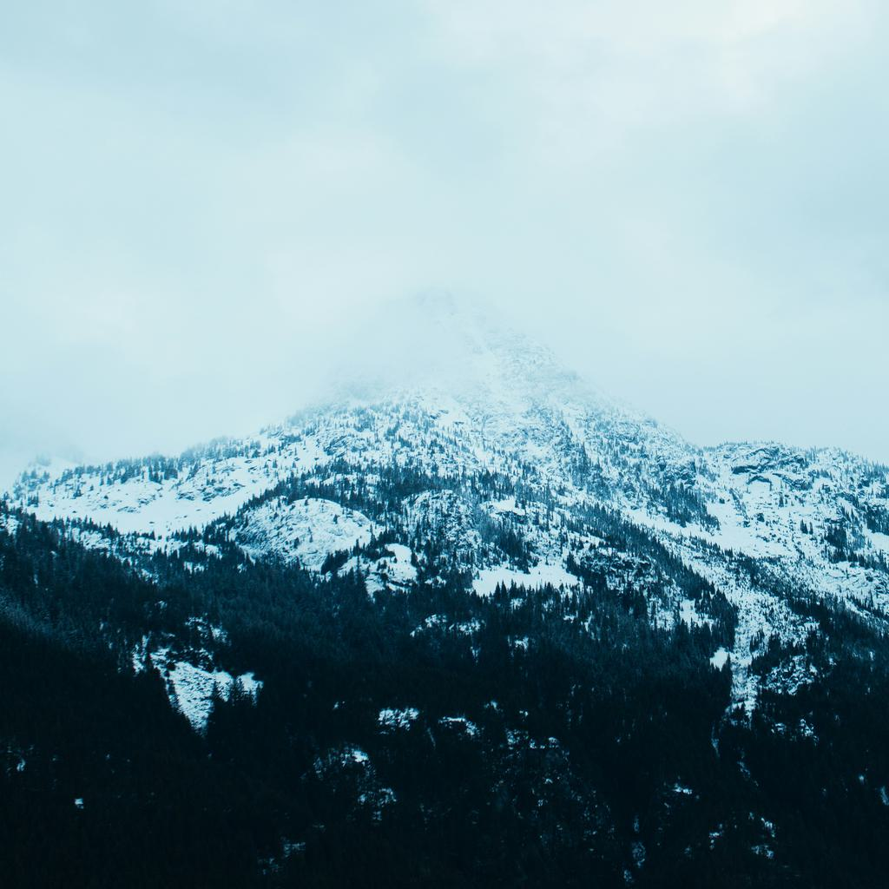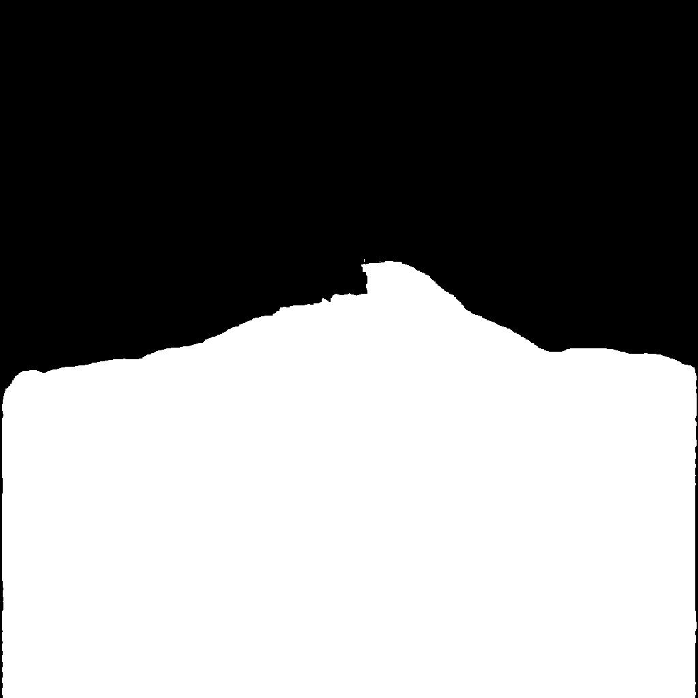**  

**U-net results**  

But, I ran 40-ish u-net tests, and should present the results. I ran them locally, on cpu, on my computer. The main hyperparameters changed from run-to-run were:

- Learning rate  
- Loss function (SCE or DICE)  
- Canny in skip connections  
- Steps per epoch (kept between 8-12)  
- Image size (128x128 or 256x256)  
- Output activation function (+ from\_logits vs not)

A note: I realize that I should have varied far fewer hyperparameters. And by the end, I did. I largely stuck to a learning rate of either 1e-4 or 5e-5, based on literature. Additionally, most hyperparameters were either functionally binary (like loss function or image size), or had a very small range. 

I was interested in, obviously, accuracy and loss metrics, but I was mostly interested in visualizing how they learned. Below, you will see gifs that show the resized image, the true mask, and the estimated mask at the end of each epoch. You will also see values for val\_loss and val\_accuracy, and loss curves.

All trials ran for 300 epochs, with early stopping and learning rate reduction. All stopped before 300 epochs. (See code for ES implementation). All had the same train length (number of training images), buffer size, and all non-tutorial trials had the same dropout rates (see code for specifics). All non-tutorial trials also utilized a batch normalization layer in each convolution block, while the tutorial trials did not. Some trials were full color, some were single channel.

I've shown best results below. When looking at all output gifs, I noticed, often, the edge information was getting lost, and the predicted mask didn't adhere to any grounded structure. So I added the Canny skip connection, as a means to try and force a grounded edge context. This only kind of worked. Depending on which depth of block I added the Canny, it would at times railroad all other information, and the predicted mask would be far too informed by harsh edges in the photo. All the same, it helped me to understand both what was happening in the training process, and how to customize a TF training pipeline.

This is just an overview of the results. It is more intended as a snapshot of the U-net training process, and an examination as to where U-nets fail in this instance. In the tutorial trials, the encoder is a pretrained MobileNetV2 mode.  More detailed results will be uploaded in an accompanying table. 
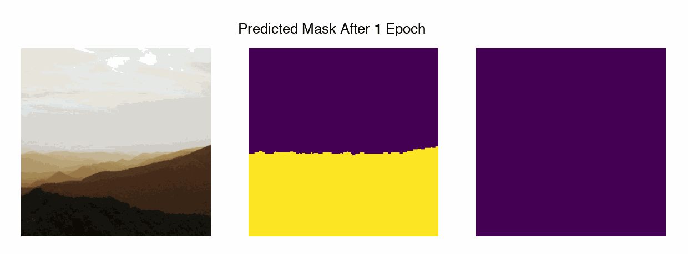  

  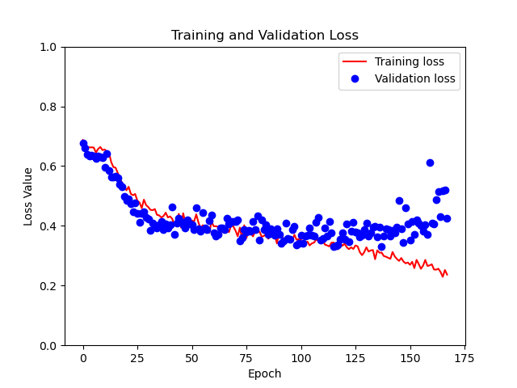

   

**Tutorial?:** No **Loss Function:** SCE **Steps per Epoch:** 15 **Canny:** None **Output Activation:** Sigmoid **Image Size:** 256x256 **LR:** 5e-5  
**Val Loss:** 0.3072 **Val Accuracy:** 0.8544  
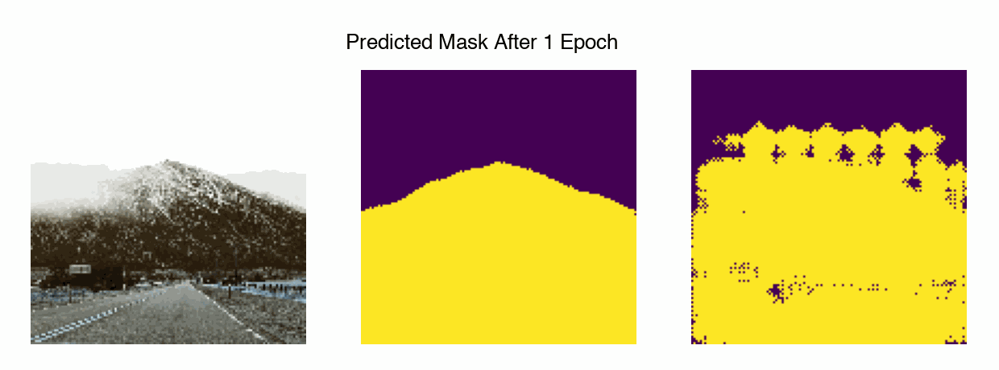  

  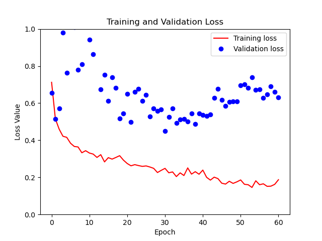

   

**Tutorial?:** Yes **Loss Function:** SCE **Steps per Epoch:** 8 **Canny:** None **Output Activation:** None **Image Size:** 128x128 **LR:** 1e-4  
**Val Loss:** 0.365 **Val Accuracy:** 0.829  
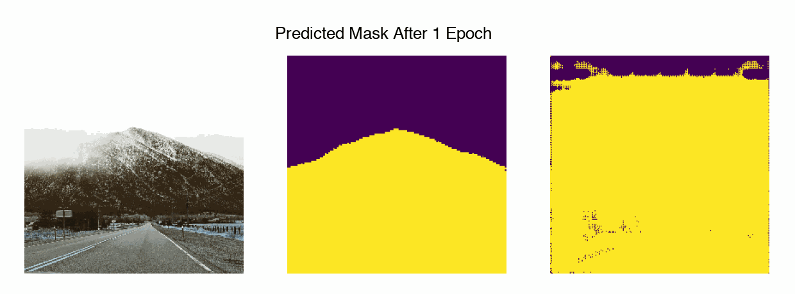  

  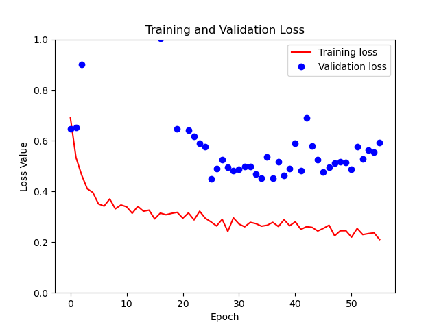

   

**Tutorial?:** Yes **Loss Function:** SCE **Steps per Epoch:** 8 **Canny:** None **Output Activation:** None **Image Size:** 256x256 **LR:** 1e-4  
**Val Loss:** 0.366 **Val Accuracy:** 0.861
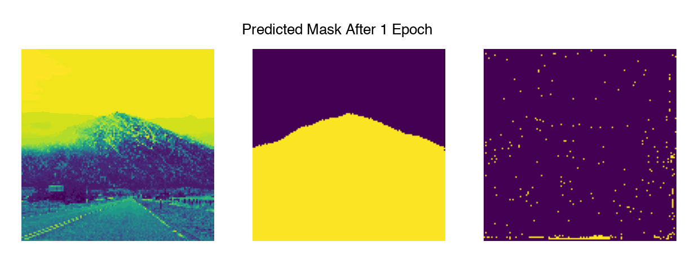  

  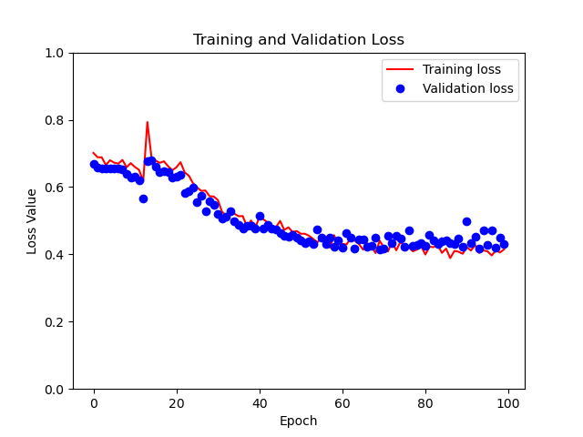

  

**Tutorial?:** No **Loss Function:** SCE **Steps per Epoch:** 8 **Canny:** bottom 2 blocks **Output Activation:** Sigmoid **Image Size:** 128x128 **LR:** 1e-4  
**Val Loss:** 0.380 **Val Accuracy:** 0.802  
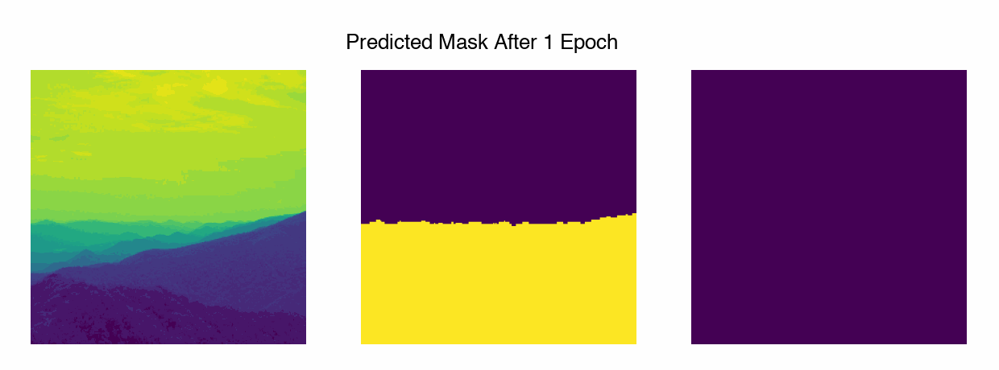  

  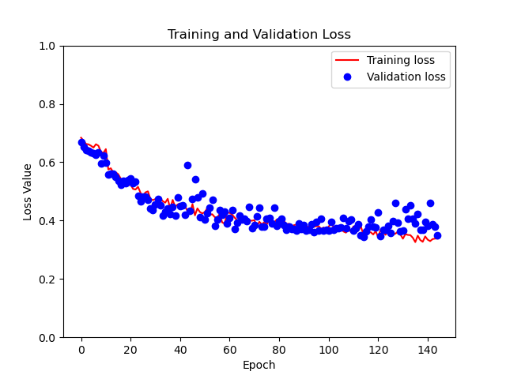

 

**Tutorial?:** No **Loss Function:** SCE **Steps per Epoch:** 15 **Canny:** top 2 blocks **Output Activation:** Sigmoid **Image Size:** 256x256 **LR:** 5e-5  
**Val Loss:** 0.361 **Val Accuracy:** 0.8141  

​**Conclusions:**

- Canny concatenated skip connections in upper blocks give far too much importance to strong edges.  
- Qualitatively, prominent peaks were more easily segmented.  
- 3 channels \> 1 channel.  
- Cross shaped artifacts only present in MobileNetV2 encoder (tutorial).
- Despite having strong accuracy values, the tutorial U-net trials had a propensity towards overfitting.
- Image size has little bearing on loss and accuracy.

**Future steps:**  

What I will try next:

- Increasing training data  
  - While this could improve segmentation via U-nets, it likely doesn’t solve the fundamental snowy peak problem.  
  - Could use AWS Mechanical Turk to do this.  
- CNN-registration (implementing https://github.com/inrainbws/cnn-registration/blob/publish/README.md).  
  - By bypassing the segmentation step, perhaps I could also bypass the snowy peak problem.  
- Training u-nets on non-cloud corrupted images (just to get a working version out there.)  
- Search more hyperparameters (can use AWS with hyperband or bayesian search.)

But I also have learned a lot\! That’s what I really wanted\! The goal wasn’t necessarily to make this thing functional. This app already exists. The true goal of this project was to learn. So I might switch gears to investigating other algorithms I find interesting.
